# alpha-omega — Agent Harness

## What is this? (in plain words)

Think of it as a **standard operating procedure (SOP) for an AI coding tool.**

You drop this folder into a project. When you open the project with an AI coding
tool (opencode, Claude Code, Cursor, Copilot, Gemini), the AI reads these files
and **stops improvising**. Instead of just doing whatever you type, it follows a
disciplined process: read the config → understand your request → decompose it →
plan it → ask you to approve → execute in the right order → verify only if you
asked.

**The result:** more consistent, higher-quality code, and fewer wasted tokens
(it picks the right model/tier per task, and never reads more than it needs).

> It is NOT a new model, and NOT a framework you code against. It's **instructions
> + a config + a few tiny scripts** that the AI follows. Each AI tool reads **one
> thin gate entry** (a file) that points to the generic content. opencode and
> Claude read `AGENTS.md` / `.claude/CLAUDE.md`; Cursor, Copilot and Gemini read their own
> gate file (`.cursor/rules/nsp-rev.mdc`, `.github/copilot-instructions.md`,
> `.gemini/GEMINI.md`). No content is auto-registered or duplicated per tool.

---

## The 3 things that make it work

1. **`config.json`** — the control panel. The AI reads this first.
2. **The instructions** (`.claude/CLAUDE.md`, `protocol.md`, `GUIDE.md`, `rules/`, `skills/`) — the process it follows.
3. **The gates** — one thin entry per AI tool that points to the generic content (no duplication, no auto-registration).

### `config.json` — the control panel (explained, dummy-level)

| Key | What it does | Example |
|-----|-------------|---------|
| `ai_org` | **which ONE AI tool to read.** Only that folder is read. | `"opencode"` |
| `switch.stacks` | **the active stacks** (array). Each stack's knowledge lives at `skills/<stack>/`. | `["nestjs", "react"]` |
| `switch.components` | which content folders are on (`core`, `rules`, `skills`, `evals`). | `["core","rules","skills","evals"]` |
| `switch.meta_prompting` | `true` = AI asks context once + shows a plan to approve. `false` = acts directly. | `true` |
| `switch.feature_registry` | `true` = AI tracks every task in `features.json` (status + metrics). | `true` |
| `mcp` | **MCP servers to use.** `servers` = list; if empty, a `message` explains. | `{"servers":[],"message":"..."}` |
| `blocked_files` | **file patterns the AI must NEVER read** (secrets, .env, keys). | `[".env","*.pem","*.key"]` |
| `scripts` | **which scripts the AI may run** (on/off). `false` = it won't run it. | `{"lint":true,"test":true}` |
| `budget` | token limits per session. | `{"session_tokens":24000}` |
| `actions` | **what the AI may do**, by power (git, files, execution, network, deploy). `true`/`false`. | `{"power_git":{"commit":false}}` |

**The two most important for control:** `blocked_files` (secrets it must never read)
and `actions` (what it's allowed to do). Both are checked on EVERY prompt.

**Multiple stacks & skills (your point 5) — it's simple:**
A skill's stack is just **the folder it lives in** (`skills/<stack>/`). To use a
frontend + a backend stack, list both:

```json
"switch": { "stacks": ["nestjs", "react"] }
```
- `skills/nestjs/` → the backend stack (its skills).
- `skills/react/` → the frontend stack (its skills).

Each skill belongs to a stack by being inside that stack's folder. That's it.

---

## What happens on the first prompt

### Do you need to do something before? **Just 2 things.** Everything else the AI does itself.

```mermaid
flowchart TD
    subgraph ACTIVATION["① ACTIVATION — the 2 human steps"]
        direction TB
        A1[1 · Copy the harness to the project<br/>cp -r alpha-omega /path/to/project] --> A2[2 · Edit config.json<br/>set the knobs: ai_org · switch.* · mcp · blocked_files · scripts · actions]
    end
    subgraph PROMPT["② THE FIRST PROMPT — the AI runs this. Each step is governed by a config key (shown in [brackets])"]
        direction TB
        P0[User writes a prompt] --> P1["Read config.json FIRST<br/>[ai_org] which folder to read"]
        P1 --> P1b["Check blocked_files<br/>[blocked_files] NEVER read those files"]
        P1b --> P1c["Check mcp<br/>[mcp] which servers to use"]
        P1c --> P2["Read the gate entry (CLAUDE.md / AGENTS.md)<br/>[switch.components] then your adapter state"]
        P2 --> P2b{adapter state exists?}
        P2b -->|no| P2c[AI CREATES its adapter state<br/>from memory/ templates — by itself]
        P2b -->|yes| P3{"[switch.meta_prompting]?"}
        P2c --> P3
        P3 -->|yes| P4[Normalize to META-PROMPT<br/>ask context once if empty]
        P3 -->|no| P5[Operate directly]
        P4 --> P6[Decompose into sub-acts<br/>multi-intent: 1 prompt = several questions]
        P5 --> P6
        P6 --> P7[Route each sub-act<br/>ROUTING.md §11 synapse<br/>complexity+intent → neuron → tier T1-T4]
        P7 --> P8["Check budget<br/>[budget] Σ budget_i ≤ session_tokens"]
        P8 --> P9["Load active stack knowledge<br/>[switch.stacks] skills/stack/ just-in-time"]
        P9 --> P10[Plan + APPROVAL GATE]
        P10 -->|A Approve| P11["Execute T1→T4, cheap first<br/>[actions] only what's allowed"]
        P10 -->|C Change| P9
        P10 -->|X Cancel| P14[Cancel]
        P11 --> P12["Verify ONLY if you asked<br/>[scripts] or a script is enabled"]
        P12 --> P13[Reinforce<br/>write routes.jsonl]
        P13 --> P14[Consolidate<br/>your adapter state]
        P14 --> P14b{"[switch.feature_registry] on?"}
        P14b -->|yes| P14c["Update features.json<br/>[switch.feature_registry] status + metrics"]
        P14b -->|no| P15[Deliver result + evidence]
        P14c --> P15
    end
    A2 --> P0
```



**Which config key governs each step?**

| Config key | Governs | Where in the flow |
|-----------|---------|-------------------|
| `ai_org` | which gate is read (opencode→`AGENTS.md`, claude→`.claude/CLAUDE.md`, etc.) | P1 — reading config |
| `switch.stacks` | which stacks are active → `skills/<stack>/` | P9 — loading knowledge |
| `switch.components` | which content folders are on (`core`/`rules`/`skills`/`evals`) | P2 — what's available to read |
| `switch.meta_prompting` | ask context once + show a plan to approve, or act directly | P3/P4 — the meta-prompt gate |
| `switch.feature_registry` | track every task in `features.json` | P14b/P14c — consolidate |
| `mcp` | which MCP servers to use | P1c — before reading files |
| `blocked_files` | files the AI must NEVER read | P1b — before reading files |
| `scripts` | which scripts the AI may run (lint/test/build…) | P12 — verify step |
| `budget` | token limits per session | P8 — budget check |
| `actions` | what the AI may do, by power (git/files/execution/network/deploy) | P11 — execute (and everywhere it acts) |

**Key points:**
- **You only do 2 things before** (copy + edit config). No manual state setup.
- **The AI self-initializes**: if its adapter state is missing, the AI creates it
  (from the `memory/` templates — the format) so it can keep control over time.
- **Verification is on-demand** (your point 6): lint/tests run only when **you ask**
  or when the script is **enabled** in `config.json → scripts`.
- **Once configured, it's on from the first read of `config.json`** — no mid-session activation.

---

## The map (where everything is)

| Need | File |
|------|------|
| The law (loop, tiers, contracts) | `protocol.md` |
| The agent manual (how to operate, what NOT to do) | `GUIDE.md` |
| Master entry (the model reads this first) | `.claude/CLAUDE.md` |
| The control panel (ai_org, stacks, scripts, actions) | `config.json` |
| Routing (single source: situation → agent + complexity → tier) | `ROUTING.md` |
| Action control by powers | `actions.md` |
| State (per adapter; format from `memory/` templates) | your adapter folder (e.g. `.opencode/memory/STATE.md`) |
| Generic agent roster (all adapters) | `agents/` |
| Generic rules (never omit) | `rules/` |
| Generic commands (what you can run) | `commands/` |
| Universal skills | `skills/<name>/` |
| **Active stack knowledge** (`skills/<stack>/` per stack) | `skills/nestjs/` |
| The pattern linter (deterministic quality gate) | `scripts/lint-patterns.js` |
| Honest pheromone + budget allocation | `scripts/routes.js` · `scripts/budget.js` |
| The gates — **one thin entry per tool** (points to generic, no auto-registration) | `AGENTS.md` (opencode) · `.claude/CLAUDE.md` (claude) · `.cursor/rules/nsp-rev.mdc` · `.github/copilot-instructions.md` · `.gemini/GEMINI.md` |

> **Gates are thin, not copies.** The generic content (agents, rules, commands,
> skills, neurons, config) lives at the root and is loaded **just-in-time**. Each
> gate is ONE file that reads `config.json` and points to the generic content.
> Nothing is auto-registered, so there is no token leakage.

---

## Feature tracking (when features.json / features.schema.json activate)

These two files are **one feature tracker** (NOT "for Anthropic" or "for GPT" — they
work together as data + schema):

- **`features.json`** — the state of your features (id, status, tier, tokens, score, time).
- **`features.schema.json`** — the contract that validates `features.json` (JSON Schema).
- `scripts/features.js` validates the data against the schema.

**When do they activate?** Only when `config.json → switch.feature_registry` is `true`
(default). When on, **every task** the AI does registers/updates a feature entry and
moves it through its lifecycle:

```
proposed → planned → in_progress → blocked → done | rejected
```

It records real metrics per feature (time_actual_ms, tokens_actual, score, retries).
**If you don't want feature tracking**, set `switch.feature_registry: false` (and you can
delete `features.json` + `features.schema.json`).

---

## Quick start

1. **Copy** the harness to the project: `cp -r alpha-omega /path/to/project`.
2. **Edit `config.json`** — set `ai_org`, `switch.stacks`, `scripts`, `actions`, `budget`.
3. **Write your first task.** The harness decomposes, routes, plans, executes,
   and consolidates. It auto-creates its adapter state.
4. **Request verification when you want it** (e.g. `/lint`, or run tests).

---

## Quality gate (on demand)

`scripts/lint-patterns.js` checks real code against `rules/coding.md`:
`file-too-long` · `console-log` · `long-function` · `too-many-params` ·
`controller-repo` · `query-returns-entity` · `vo-not-frozen`.

It's deterministic (~0 tokens) and exits `1` on violations. Run it **only when you
ask**: `node scripts/lint-patterns.js` or `/lint`. It only runs if
`config.json → scripts.lint` is `true`.

---

## Actions (powers)

`config.json → actions` controls what the AI may do. `true` = allowed, `false` = forbidden.

```
power_git:         create_branch ✓  switch_branch ✓  commit ✗  push ✗
power_files:       read ✓  write ✓  edit ✓  delete ✗
power_execution:   bash ✓  install ✓  tests ✓  build ✓
power_network:     fetch ✗  web_search ✗
power_deploy:      staging ✗  production ✗  rollback ✗
```

**Golden rule:** the CONFIG rules. If an action is `false`, the AI does not do it.

---

## Copy to a new project

```bash
cp -r alpha-omega /path/to/new-project/
```

Then edit `config.json` for the project (ai_org, stacks, scripts, actions, budget).
