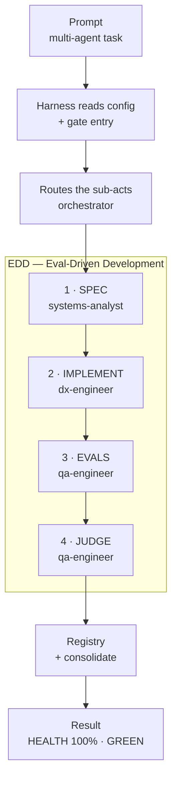

# TESTING.md — Multi-Agent EDD Test Map

> This documents one end-to-end validation of the alpha-omega harness. It shows,
> step by step, how a multi-agent prompt flows through the harness and is
> validated with **EDD** (SPEC → EVALS → IMPLEMENT → JUDGE). Read it to understand
> how the harness behaves; run the same test on your own project to verify it.

## The test prompt (multi-agent)

> *"Add a `/check` command that validates the harness health (valid config JSON,
> lint OK, budget OK). Use EDD. Coordinate with the orchestrator."*

This touches several roles, so the orchestrator routes it to multiple agents.

## Sequential flow



## What each step does (for a human reader)

| Step | Who | What happens |
|------|-----|--------------|
| Prompt | user | A task that needs 2+ roles arrives. |
| Harness reads config | agent | Reads `config.json` + the gate entry; checks `blocked_files`/`mcp`. |
| Routes sub-acts | orchestrator | `ROUTING.md §11` → maps each sub-act to a neuron + tier + budget. |
| 1 · SPEC | systems-analyst | Writes the spec (problem, design, acceptance criteria). |
| 2 · IMPLEMENT | dx-engineer | Implements the feature (deterministic script + command). |
| 3 · EVALS | qa-engineer | Runs the feature against its criteria — both the happy and the failure path. |
| 4 · JUDGE | qa-engineer | Scores 0-1; if < 0.7 retry differently (max 3), then escalate. |
| Registry + consolidate | agent | Registers the feature in `features.json` + writes `memory/STATE.md`. |
| Result | agent | Reports the measured outcome (score + health). |

## The results (measured)

**Happy path** — the feature works:
```
✅ config: PASS — valid
✅ lint: PASS — 0 violation(s)
✅ budget: PASS
HEALTH SCORE: 100% (3/3 gates)   exit: 0
```

**Failure path** — the eval catches a broken config:
```
❌ config: FAIL — parse error
❌ budget: FAIL — exited non-zero
HEALTH SCORE: 33% (1/3 gates)   exit: 1   (correct — it did NOT pass)
```

**Registry contract** — `features.json` validated against its schema:
```
features registered: 2 | by status: done=2 | average score: 0.97 | STATUS: GREEN
```

## What this validates

- **Multi-agent really works** — four agents did distinct, sequential work
  (spec → implement → evals/judge → coordinate), not one agent doing everything.
- **EDD really works** — SPEC → IMPLEMENT → EVALS (both paths) → JUDGE (score).
- **No token leak** — the harness read just-in-time (~8.7k tokens) instead of the
  whole stack (~121k). The stack index tells the AI to read only the pattern that fires.
- **Traceability** — every action is recorded: spec, code, evals, registry, state.

> This map is the *documentation* of one test. The artifacts it created are
> examples of the harness's output, not part of the harness core.
