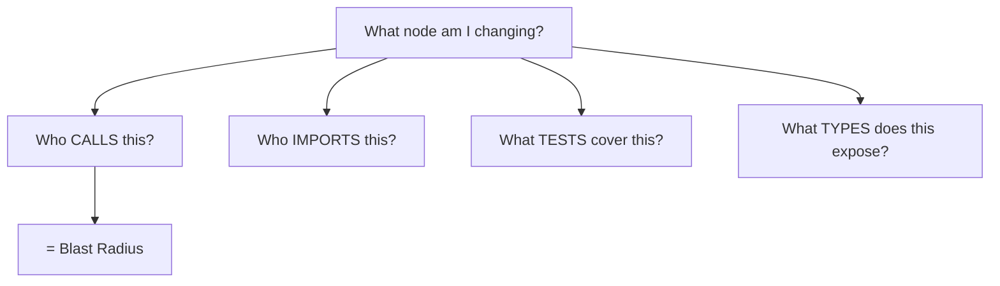
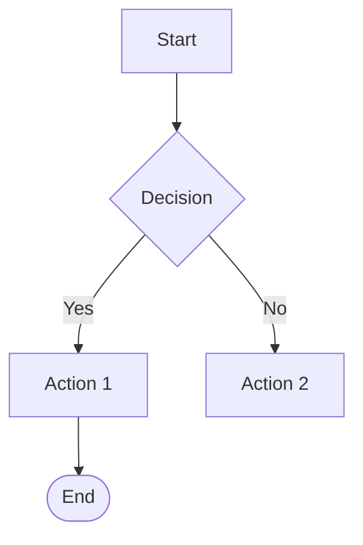
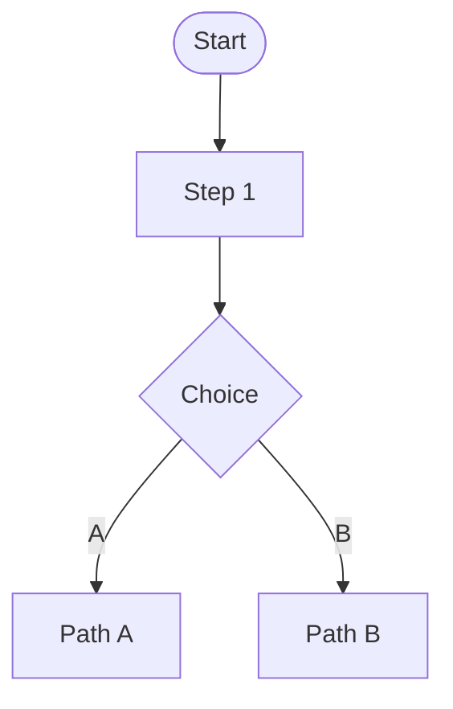
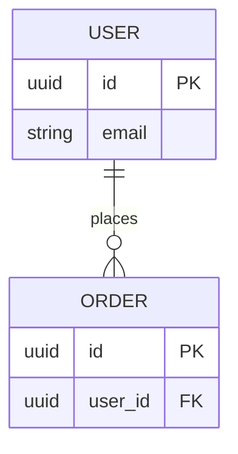
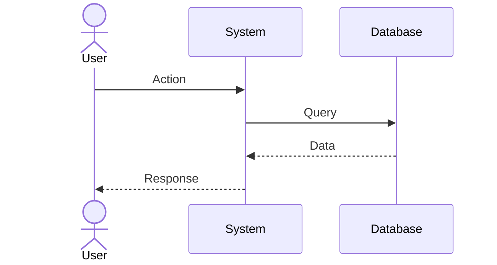

# Graph Thinking Rule

> AI thinks in NODES and EDGES, not files and folders.
> This saves 5-10x tokens on code reviews and impact analysis.

## Core Principle
Code is a graph. Every function, class, file, and type is a NODE.
Every call, import, inheritance, and dependency is an EDGE.
Before changing any node → trace its edges → know the blast radius.

## Node Types
```
FILE      → path, language, size
CLASS     → name, file, methods, modifiers
FUNCTION  → name, file, params, return_type, is_test?
TYPE      → name, file, kind (enum, interface, type alias)
TEST      → name, file, tested_function
```

## Edge Types
```
CALLS         → Function → Function
IMPORTS_FROM  → File → File (dependency chain)
INHERITS      → Class → Class
IMPLEMENTS    → Class → Interface
TESTED_BY     → Function → Test (coverage map)
DEPENDS_ON    → Node → Node
```

## Before ANY Change


## The 3 Graph Diagrams
```
diagrams/code-graph.mermaid   → Functions, classes, calls, imports
diagrams/code-deps.mermaid    → File → File import chains
diagrams/code-tests.mermaid   → Which functions have tests
```

## Build: /build-graph
Run once at project start, then incrementally after changes.

## Token Math
```
WITHOUT graph: read 200 files → ~150K tokens per review
WITH graph:    read 3 diagrams + 8 files → ~25K tokens
SAVINGS: 83% reduction
```

## Mermaid Syntax Quick Reference

### graph TD/LR


### flowchart TD/LR


### erDiagram


### sequenceDiagram


### gantt
```mermaid
gantt
    title Project
    dateFormat YYYY-MM-DD
    section Design
    Architecture :done, d1, 2024-01-01, 3d
    section Development
    Backend :todo, d2, after d1, 5d
```

## Rule: Diagrams ARE the Graph
A graph node costs ~5 tokens. A text paragraph costs ~100 tokens.
Always prefer graph over text when communicating structure.